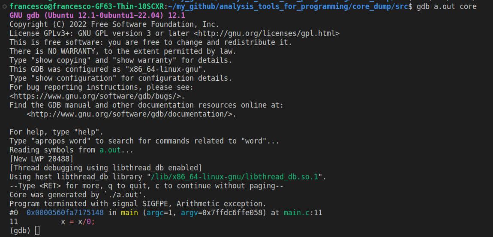

# Core dump

## Definition

A core dump consists of the recorded state of the working memory of a computer program at a specific time, generally when the program has crashed or otherwise terminated abnormally.

## Example of usage


There are some situations where we would like to analyze a malfunction, but in the case of an air fighter in flight it is impossible to use the debbuger.

In this case, a snapshot of the memory is useful to understand where is the bug in our code and avoid another time critical moment like this one.

## How to use

Firstly, you should run this command in the command line:

```bash
ulimit -c
```

ulimit is a built-in Linux shell command that allows viewing or limiting system resource amounts that individual users consume. In particular, with "-c" this command returns the core dump size (expressed in the number of 512-byte blocks).

If the command result is equal to 0, we should set the right space to create and save the core dump file generate after a crash of the program.
For this reason, run the following command to allocate an unlimited space for the core dump file (you can add it in your .bashrc file):

```bash
ulimit -c unlimited
```

In this project, a simple c program has been written where there a number is divided by 0.
Run the following command to compile, run the program:

```bash
gcc -g main.c
./a.out
```

The -g option instructs the compiler to include debugging symbols in the compiled program, which enables a programmer to debug the program using a debugger like gdb.

When you run the program a message like "Aborted (core dumped)" should be present: this implies that the core dump file was generated.
For Ubuntu 22.04, the file will be present in [/var/lib/apport/coredump/](/var/lib/apport/coredump/) folder.
If you prefer, you can change the directory changing the parameter kernel "kernel.core_pattern" through the following command:

```bash
sudo sysctl -w kernel.core_pattern=/var/crash/core-%e.%p.%h.%t
```

### How to use the core dump file

Now, you are able to use the core dump file, with the gdb command which will jump to the moment captured by the core file, running the following instruction:

```bash
gdb a.out /path_core/core_name
```

The result is shown in the picture below.


